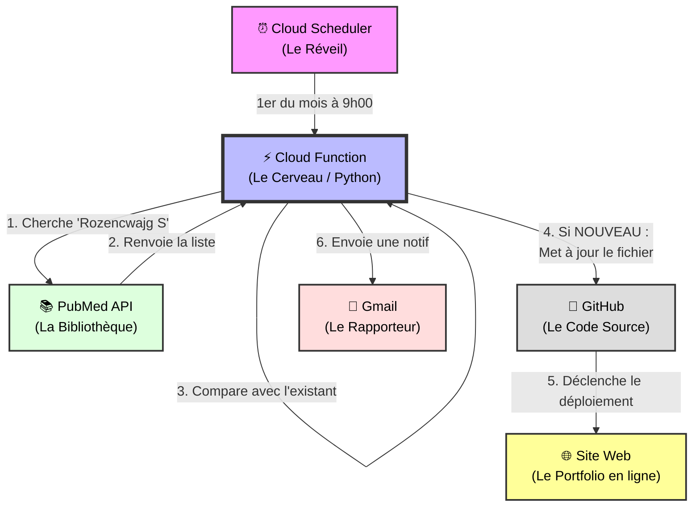

# 🤖 Comment fonctionne mon Assistant de Publications ?

*Une explication simple de l'architecture mise en place pour automatiser la veille scientifique.*

---

## 📊 Le Concept en un coup d'œil

Imaginez un **assistant virtuel** qui travaille pour vous 24h/24, même quand votre ordinateur est éteint.
Chaque mois, il se réveille, va à la bibliothèque (PubMed), vérifie s'il y a de nouveaux articles à votre nom, met à jour votre CV, et vous envoie un rapport.

Voici comment cela fonctionne techniquement, visualisé sous forme de schéma :

---

## 🛠 Les Outils Utilisés (La "Tech Stack")

Pour créer ce système, nous avons utilisé des technologies "Serverless" (sans serveur à gérer) de Google :

1.  **Google Cloud Scheduler** ⏰
    *   *C'est quoi ?* Un planificateur de tâches (cron job).
    *   *Rôle :* C'est le réveil-matin. Il est programmé pour dire "Go !" le 1er de chaque mois.

2.  **Google Cloud Functions** ⚡️
    *   *C'est quoi ?* Un petit bout de code (écrit en **Python**) qui s'exécute dans le nuage.
    *   *Rôle :* C'est le cerveau. Il ne tourne que quelques secondes par mois (très écologique et économique).
    *   *Intelligence :* Il sait parler à PubMed, lire les données, formater du HTML, et envoyer des emails.

3.  **API PubMed (E-utilities)** 📚
    *   *C'est quoi ?* L'interface officielle de la National Library of Medicine.
    *   *Rôle :* Fournir les données brutes fiables.

4.  **GitHub & CI/CD** 🐙
    *   *C'est quoi ?* Là où le code du site est stocké.
    *   *Rôle :* Quand la fonction modifie le code (ajoute une publication), GitHub détecte le changement et met à jour le site visible par tout le monde automatiquement.

## 📝 Scénario Typique

1.  **1er Mars, 9h00** : Le *Scheduler* active la *Fonction*.
2.  La *Fonction* demande à *PubMed* : "Quoi de neuf pour Rozencwajg S ?".
3.  *PubMed* répond : "J'ai 40 articles".
4.  La *Fonction* vérifie sa mémoire : "J'en avais 39 le mois dernier. **Il y en a 1 nouveau !**".
5.  Elle récupère le titre, le journal et l'année du nouvel article.
6.  Elle crée le code HTML pour l'afficher joliment.
7.  Elle l'ajoute directement dans le code du site sur *GitHub*.
8.  Elle vous envoie un **Email** : "🚀 Une nouvelle publication ajoutée !".
9.  Quelques minutes plus tard, votre site est à jour.

Tout cela se passe en environ **10 secondes**, sans aucune intervention humaine.
